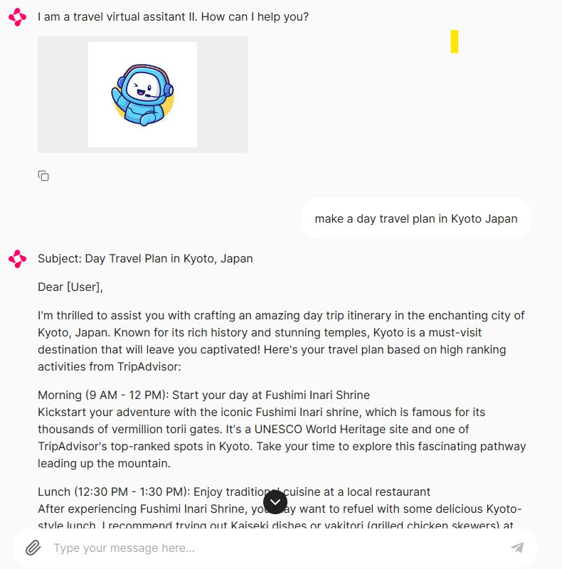

# Chatbot Exploration Project

Welcome to my Chatbot Exploration Project repository! This project is dedicated to the exploration and understanding of generative AI technology through the development of various chatbots. Utilizing frameworks like Langchain, Ollama and Chainlit, this initiative aims to delve into the capabilities and potential applications of conversational AI systems.

## Project Overview

The goal of this project is to create a series of chatbots that can demonstrate the power of generative AI. Each chatbot is designed to showcase different aspects of AI-driven conversation.

## Technologies Used
- **Langchain**: Utilizing its language model chaining functionality to enhance the chatbot's understanding and response generation.
- **Ollama**: A platform known for its robust AI models that provide a foundation for creating intelligent chatbot interactions.
- **Chainlit**: An innovative tool that allows for the seamless integration of AI functionalities into chatbot frameworks, enhancing their conversational abilities.

## Getting Started

To get started with this project, clone the repository and explore the individual chatbot files. Each file contains the source code, along with comments on explaining the logic of the code.

### Prerequisites
- Ollama installation: [Get Ollama](https://ollama.com) and install the models needed.

To get a glimpse of the chatbots in action, follow the instructions below:

1. Clone the repository and explore the individual chatbot files. Each file contains the source code, along with comments on explaining the logic of the code.
2. Install the required dependencies as listed in the respective `requirements.txt` files.
3. Run the following commands to run the chatbots.

    `chainlit run <chatbotfile.py> -w`

### Chatbots showcase
1. A travel assistant bot using a local Phi3 model
